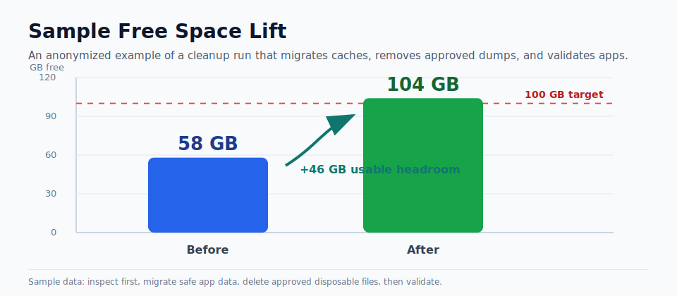
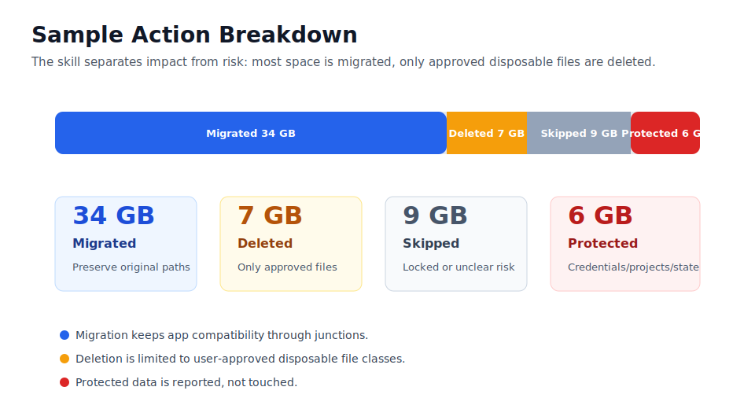
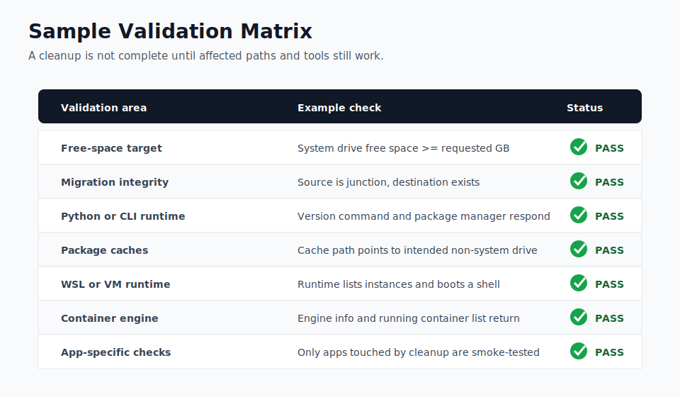

# Clean C Drive Safely

中文优先说明：这是一个面向 Windows 的成熟 C 盘/系统盘安全清理 Skill。它不是简单地“删缓存”，而是按专业维护流程工作：先只读审查，再风险分级，再迁移或删除，最后验证软件是否仍然可用。

> 展示图表使用匿名示例数据。真实结果取决于电脑配置、已安装软件、权限、目标盘空间和用户批准的清理范围。

## 中文介绍

`clean-c-drive-safely` 适合这些场景：

- C 盘空间不足，需要尽量释放空间。
- 想把缓存、包管理器数据、开发工具缓存迁移到 D/E/其他盘。
- 想迁移 WSL、Docker、Python、Node、Arduino、Rust、Java 等开发环境相关数据。
- 需要清理截图、崩溃转储、临时文件，但不想误删项目、文档、凭据或正在使用的软件数据。
- 清理后必须验证 Docker/WSL/Arduino/Python/Node/其他软件是否还能正常运行。

核心原则：

- 默认只读审查，不先动文件。
- 默认 dry-run，不直接删除或迁移。
- 删除只针对用户明确批准的文件类型或模式。
- 应用数据优先迁移并创建 junction，保留原来的 Windows 路径。
- `.codex`、凭据、SSH key、源码仓库、文档、活跃数据库、未知业务数据默认保护。
- 清理完成后必须验证被影响的软件。

## 效果展示

### 空间释放效果



### 操作分类占比



### 软件验证矩阵



## 安装到 Codex

### Windows PowerShell

```powershell
$skills = "$env:USERPROFILE\.codex\skills"
New-Item -ItemType Directory -Force -Path $skills | Out-Null
git clone https://github.com/sunzhejian/clean-c-drive-safely-skill.git "$skills\clean-c-drive-safely"
```

更新：

```powershell
git -C "$env:USERPROFILE\.codex\skills\clean-c-drive-safely" pull
```

使用时可以直接说：

```text
Use $clean-c-drive-safely to audit my Windows C drive and safely move caches to D or E.
```

### macOS/Linux 上的 Codex

这个 Skill 主要操作 Windows，因此通常应在 Windows 机器上运行。若你是在 macOS/Linux 上管理 Windows 机器，只建议把它作为流程参考，不要直接运行 PowerShell 脚本。

```bash
mkdir -p ~/.codex/skills
git clone https://github.com/sunzhejian/clean-c-drive-safely-skill.git ~/.codex/skills/clean-c-drive-safely
```

## 其他开发工具怎么接入

这些工具不一定原生支持 Codex Skill 规范，但可以把本仓库作为“安全清理规则包 + PowerShell 工具脚本”使用。

### Cursor

1. 克隆仓库到本地，例如 `D:\DevTools\skills\clean-c-drive-safely`。
2. 在 Cursor 中打开该文件夹。
3. 把 `SKILL.md` 和 `references/windows-cleanup-policy.md` 的核心规则加入项目规则或对话上下文。
4. 让 Cursor 调用 `scripts/` 里的脚本时，先 dry-run，再人工确认 `-Execute`。

建议提示词：

```text
Read SKILL.md and references/windows-cleanup-policy.md. Use the scripts only in dry-run mode first. Do not delete or migrate files until the candidate list and protected paths are reviewed.
```

### Claude Code

1. 克隆仓库。
2. 在 Claude Code 中把仓库作为当前项目或参考目录。
3. 让 Claude 先读取 `SKILL.md`，再按需读取 `references/`。
4. 执行脚本前要求它展示命令、源路径、目标路径和日志位置。

```powershell
git clone https://github.com/sunzhejian/clean-c-drive-safely-skill.git D:\DevTools\skills\clean-c-drive-safely
```

建议提示词：

```text
Use the cleanup workflow in D:\DevTools\skills\clean-c-drive-safely. Start with audit-c-drive.ps1 only. Treat every mutation as requiring explicit approval.
```

### Windsurf / Trae / VS Code Agent / 其他 AI IDE

通用接入方式：

1. 克隆仓库到固定路径。
2. 把 `SKILL.md` 设置为工具的规则文档或长期上下文。
3. 把 `references/` 作为按需读取的详细规则。
4. 只允许 AI 先运行审查和 dry-run。
5. 只有用户确认后，才允许带 `-Execute` 的命令。

### 只把脚本当作工具使用

审查：

```powershell
powershell -ExecutionPolicy Bypass -File scripts/audit-c-drive.ps1 `
  -SystemDrive C `
  -Top 80 `
  -OutputDir X:\CleanupLogs
```

迁移 dry-run：

```powershell
powershell -ExecutionPolicy Bypass -File scripts/migrate-to-cache-volume.ps1 `
  -SourceDrive C `
  -DestinationRoot X:\AppDataOffload `
  -SourcePaths C:\Users\me\AppData\Local\ExampleCache `
  -LogDir X:\CleanupLogs
```

批准后执行迁移：

```powershell
powershell -ExecutionPolicy Bypass -File scripts/migrate-to-cache-volume.ps1 `
  -SourceDrive C `
  -DestinationRoot X:\AppDataOffload `
  -SourcePaths C:\Users\me\AppData\Local\ExampleCache `
  -LogDir X:\CleanupLogs `
  -Execute
```

验证：

```powershell
powershell -ExecutionPolicy Bypass -File scripts/validate-cleanup.ps1 `
  -SystemDrive C `
  -TargetFreeGB 100 `
  -Checks python,node,wsl,docker `
  -RefreshUserPath
```

## English Introduction

`clean-c-drive-safely` is a Codex skill for mature Windows system-drive cleanup. It audits first, classifies risk, migrates cache or application data with junctions when compatibility matters, deletes only explicitly approved disposable files, and validates affected software afterward.

Use it when you need to:

- Free space on a Windows system drive.
- Move caches or developer-tool data to another drive.
- Preserve app compatibility through junction-based migration.
- Avoid deleting credentials, projects, documents, repositories, active databases, or agent state.
- Validate tools such as Python, Node.js, WSL, Docker, Arduino, Git, or Rust after cleanup.

Install for Codex:

```powershell
$skills = "$env:USERPROFILE\.codex\skills"
New-Item -ItemType Directory -Force -Path $skills | Out-Null
git clone https://github.com/sunzhejian/clean-c-drive-safely-skill.git "$skills\clean-c-drive-safely"
```

For Cursor, Claude Code, Windsurf, VS Code agents, and similar tools, use this repository as a rules-and-scripts package: load `SKILL.md` as the main workflow, read `references/` for detailed safety rules, and run scripts in dry-run mode before any mutation.

## 文件结构 / Repository Layout

```text
clean-c-drive-safely/
├── SKILL.md
├── agents/openai.yaml
├── references/
│   ├── application-validation-playbook.md
│   └── windows-cleanup-policy.md
├── scripts/
│   ├── audit-c-drive.ps1
│   ├── migrate-to-cache-volume.ps1
│   ├── remove-approved-files.ps1
│   └── validate-cleanup.ps1
└── showcase/
    ├── action-breakdown.svg
    ├── free-space-lift.svg
    ├── validation-matrix.svg
    └── sample-cleanup-summary.csv
```
